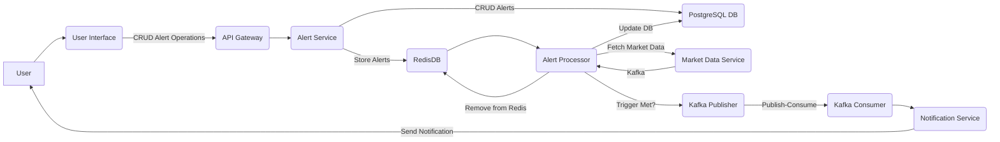
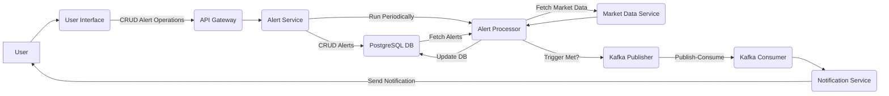

## Problem Statement

Design a price alert and notification application where users can submit alert on various criteria on crypto trading symbols and receive alerts on the same. 

## Project Design and Architecture - Backend

### 1. Requirements Analysis
We need a backend application that:
- Accepts user alerts for various cryptocurrency trading symbols(Bitcoin, Ethereum, etc.).
- Checks the criteria (price or moving average) and triggers alerts when the conditions are met.
- Allows users to view the status of their alerts.

### 2. Tech Stack
- **Language**: Java
- **Framework**: Spring Boot (for creating REST APIs and managing dependencies)
- **Database**: PostgreSQL (for storing alerts and their status)
- **Cache**: Redis (for storing pending alerts)
- **Messaging**: Kafka (for handling alert notifications efficiently, another potential use is for fetching market data)
- **External API**: Binance API (for fetching real-time price and market data)
- **Testing**: JUnit (for unit tests)
- **Serialization**: Protobuf (for communication)

### Current Design of the backend

### Potential discussion to convert to this - [CryptoAlert Platform](https://docs.google.com/document/d/1vvoHIexEKmPsqv6YN3LFrcGUmwgf0aK3JIy8ILDemsk/edit?usp=sharing)

### Steps to run the service - 
1. Ensure that you have Postgres, Kafka and Redis installed on your machine.
2. Update application.properties to match the configuration of your Kafka, PostgreSQL, and Redis instance
3. Spin up the Zookeeper and Kafka following the below commands -  
~/kafka_2.13-3.7.0/bin/zookeeper-server-start.sh ~/kafka_2.13-3.7.0/config/zookeeper.properties
~/kafka_2.13-3.7.0/bin/kafka-server-start.sh ~/kafka_2.13-3.7.0/config/server.properties
4. Spin up Redis - 
brew services start redis
5. Run the PriceAlertApplication
6. Run Postman and interact with the service using REST calls
